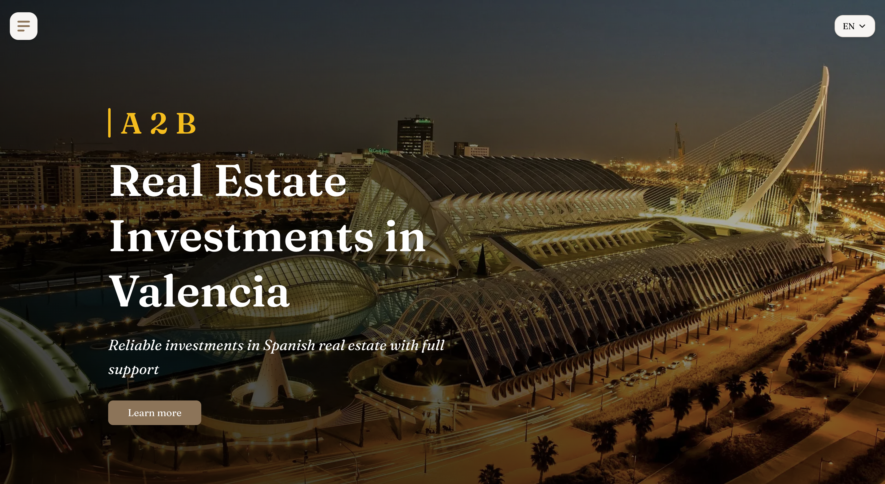
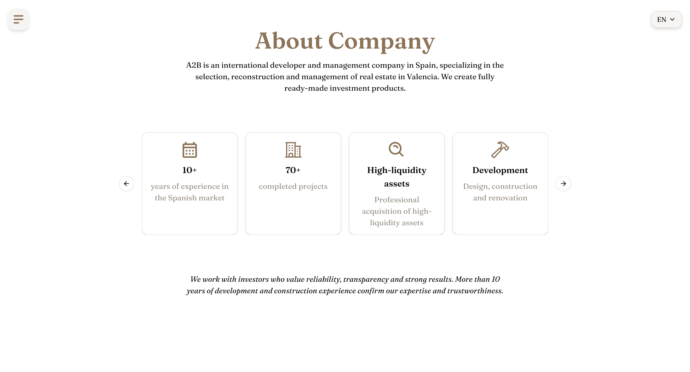
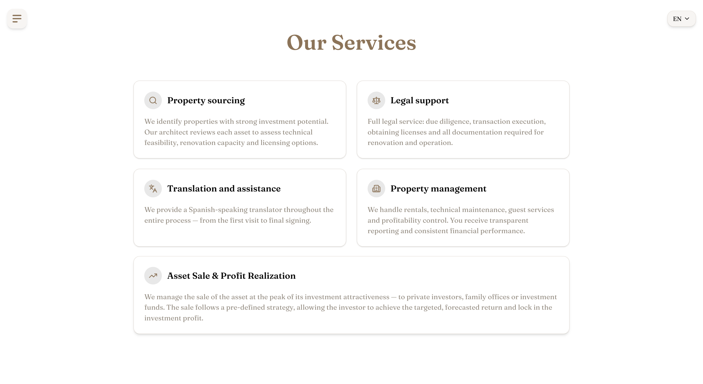
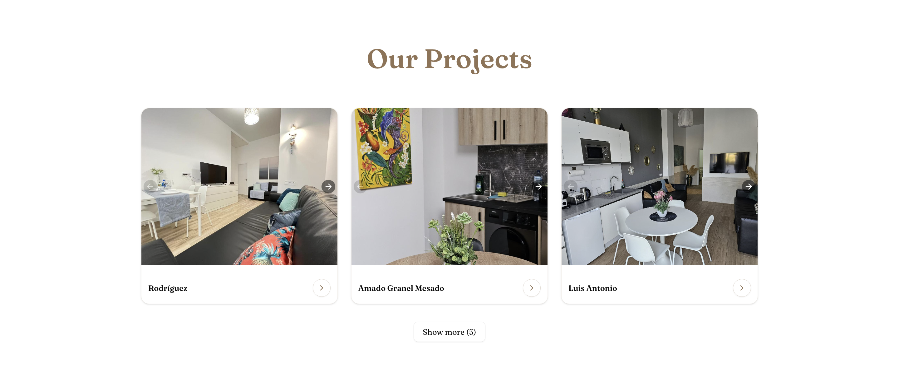
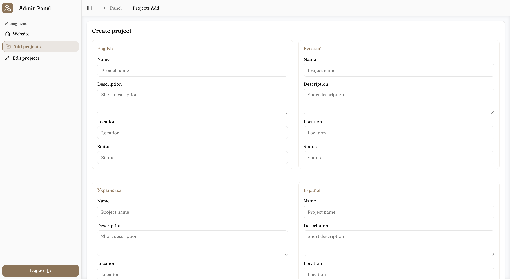
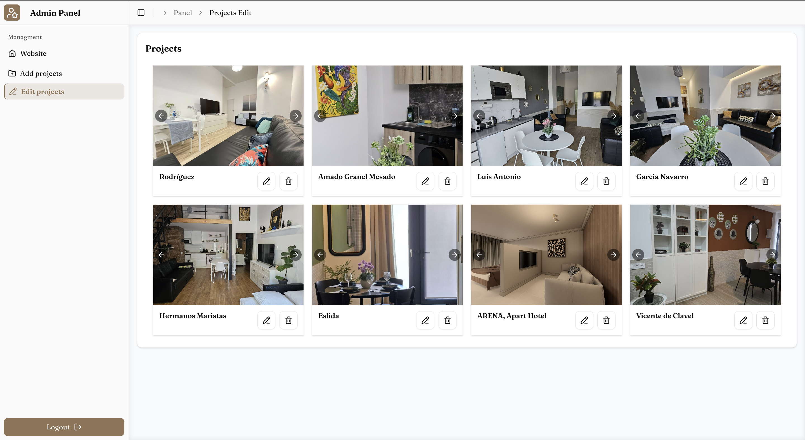

# A2B Fund — Real Estate Investment Platform

**A2B Fund** is a real estate investment platform focused on properties in Valencia, Spain.  
The website presents investment opportunities, company services, and completed projects for private investors.

**Live site:**  
https://www.a2b-group.com/en

---

# About the Project

A2B Fund is a website for a Spanish real estate investment company specializing in property acquisition, reconstruction, and management in Valencia.

The platform provides information about investment opportunities, completed projects, and services offered by the fund.

---

# Website Sections

- **About Company** — experience, key figures, advantages
- **Why Spain & Valencia** — economy, climate and benefits for investors
- **Our Services** — investment and property management services
- **Why Choose Us** — advantages of working with the fund
- **Projects** — completed and current real estate projects
- **Partners**
- **Investment Lifecycle** — stages of cooperation
- **Risk Management**
- **Our Team**
- **Contact** — contact form

---

# Features

- Multi-language support (EN, RU, UK, ES)
- Real estate project catalog
- Investment information pages
- Dynamic content managed through admin panel
- Protected admin dashboard
- Image management via Cloudinary
- Email integration for contact forms

---

# Admin Panel

The project includes a protected admin panel for content management.

Features:

- Firebase authentication
- Add and edit real estate projects
- Manage partners
- Upload and manage project images

---

# Screenshots

Some examples of the website interface.

| Description | Screenshot |
|-------------|------------|
| Hero section |  |
| About Company block |  |
| Services |  |
| Projects |  |
| Admin panel |  |
| Admin panel |  |

---

# Deployment

The project is deployed on **Vercel**.

Production website:  
https://www.a2b-group.com/en

The repository is connected to Vercel for automatic deployments on push to the main branch.

---

# Tech Stack

### Frontend

- Next.js 16
- React 19
- TypeScript

### Styling

- Tailwind CSS 4
- tw-animate-css

### Internationalization

- next-intl (EN, RU, UK, ES)

### Backend & Services

- Firebase Auth
- Firebase Admin SDK
- Cloudinary
- Resend (email service)

### UI Libraries

- Radix UI
- Vaul
- Sonner
- Lucide React
- Motion

### Forms & Validation

- React Hook Form
- Zod
- @hookform/resolvers

### Utilities

- dotted-map
- svg-dotted-map

---

# Project Architecture

- Next.js **App Router**
- Server Components
- Firebase used for authentication and admin API
- Cloudinary for image storage
- next-intl for internationalization